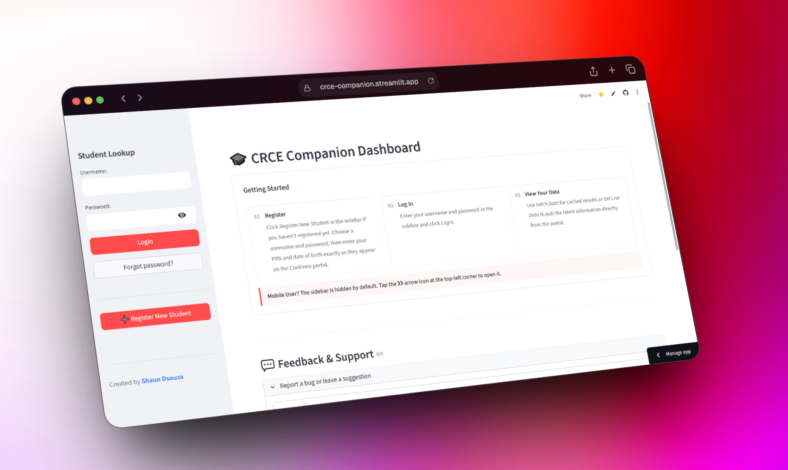
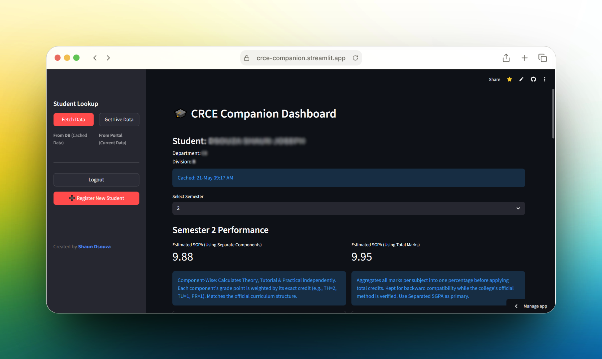
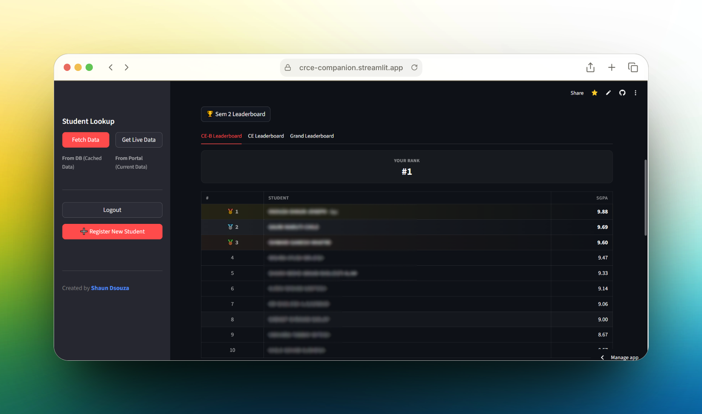

# CRCE Companion

<div align="center">


**A modern, fast, and insightful dashboard for CRCE Contineo student portal data.**

Register once, access your attendance and marks anytime — no more repetitive logins.

</div>

---

## The Problem

The official Contineo student portal is tedious to use every day:

- **Repetitive Login** — You must enter your PRN and full Date of Birth every single time you want to check your data.
- **No Insights** — The portal shows your attendance percentage, but doesn't tell you how many lectures you can safely miss or need to attend to stay above the 75% threshold.
- **No Comparison** — There's no way to see how you're performing compared to your classmates.
- **Odd/Even Separation** — Odd and even semester data lives on separate portals with different URLs, making it annoying to check both.

## Features

## Features

- **One-Time Registration** — Save your PRN & DOB once with secure bcrypt-based authentication.
- **Unified Dashboard** — Access odd and even semester data in one place.
- **Smart Attendance Insights** — Know how many lectures you can miss or need to attend to maintain 75%.
- **Detailed Marks & SGPA**
  - Component-wise SGPA calculation
  - Theory, practical, and tutorial separation
  - MSE / ISE / ESE / lab breakdowns
- **Advanced Leaderboards**
  - Grand leaderboard, Department-wise rankings, Division-wise rankings
  - Personal rank visibility
- **Live Data + Caching**
  - Instant cached fetch
  - One-click live scraping
  - Auto-refresh stale data after 1 day
  - Smart fallback on scraping failure
- **Account Utilities**
  - Forgot password support
  - Secure login system
- **Student Details Display** — Shows department and division below student names.
- **Feedback System** — Built-in feedback and rating support via Resend.
- **PWA Support** — Installable mobile-friendly app experience.

## Demo







## Tech Stack

| Layer               | Technology                                                                                                      |
|---------------------|-----------------------------------------------------------------------------------------------------------------|
| Frontend            | [Streamlit](https://streamlit.io/)                                                                              |
| Web Scraping        | [Requests](https://requests.readthedocs.io/) & [BeautifulSoup4](https://www.crummy.com/software/BeautifulSoup/) |
| Database            | [PostgreSQL](https://www.postgresql.org/) via [Neon](https://neon.tech/)                                        |
| Email Notifications | [Resend](https://resend.com/)                                                                                   |
| Package Manager     | [uv](https://docs.astral.sh/uv/)                                                                                |
| Deployment          | Streamlit Community Cloud                                                                                       |

## Getting Started

### Prerequisites

- [uv](https://docs.astral.sh/uv/) (fast Python package manager)
- Python 3.13+ (handled automatically by uv)
- A PostgreSQL database (recommended: [Neon](https://neon.tech/) free tier)

### Installation

1. **Clone the repository:**
   ```bash
   git clone https://github.com/dsouza-shaun/crce-companion.git
   cd crce-companion
   ```

2. **Install dependencies with uv:**
   ```bash
   uv sync
   ```
   This creates a virtual environment automatically and installs all dependencies from `pyproject.toml` using the locked versions in `uv.lock`.

3. **Set up environment variables:**

   Create a `.env` file in the project root:

   ```ini
   NEON_DB_PASSWORD=your_db_password
   NEON_DB_URI=your_db_host
   PG_DBNAME=your_db_name
   PG_USER=your_db_user
   EMAIL_RECEIVER=your_email@gmail.com
   RESEND_API_KEY=your_resend_key
   ```

4. **Run the app:**
   ```bash
   uv run streamlit run app.py
   ```

## How to Use

1. **Register** — Click "Register New Student" in the sidebar. Enter your details *exactly* as they appear on the Contineo portal, along with a unique username. The app validates your credentials against the live portal before saving.

2. **Fetch Data** — Type your username and click **Fetch Data** for cached results, or **Get Live Data** to scrape the latest information from both odd and even semester portals.

3. **Explore** — Switch between semesters using the "Select Semester" dropdown. View attendance insights, CIE marks breakdown, SGPI, and leaderboard rankings.

## Project Structure

A detailed breakdown of the repository is available in:

[PROJECT_STRUCTURE.md](PROJECT_STRUCTURE.md)

## Disclaimer

> **This project is not affiliated with, endorsed by, or connected to CRCE (Fr. Conceicao Rodrigues College of Engineering) or Contineo Technologies in any way.**
>
> This tool was created solely for **educational and personal convenience purposes**. It accesses publicly available student data that the user themselves is authorized to view. No data is shared, sold, or misused.
>
> Use this software responsibly and in compliance with your institution's policies. The developers assume no liability for misuse.

---

<div align="center">

Inspired by [Mark Lopes' Contineo](https://github.com/MarkLopes11/Contineo) version

</div>
